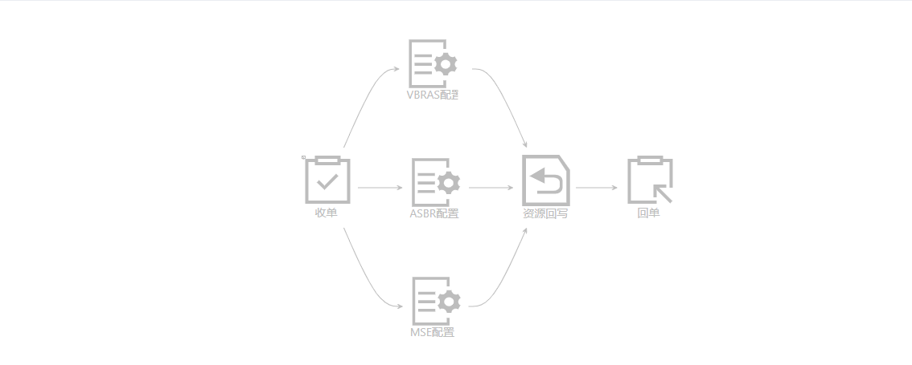

# dagre-d3-flow
使用dagre-d3自定义流程节点关系，并配置节点及连线样式

> 基本格式
```json
[
  {
    "nodeIcon":"svg",
    "nodeId":"3db4a0c3-de2f-48e2-b802-e86a7795",
    "nextNodeId":"6cfa1855-6b4a-45f2-ac65-03c876a0"
  },
  {
    "nodeIcon":"svg",
    "nodeId":"6cfa1855-6b4a-45f2-ac65-03c876a0",
    "nextNodeId":"aae5a1c3-e4a9-4f8a-a1f4-629fc37b"
  },
  {
    "nodeIcon":"svg",
    "nodeId":"6cfa1855-6b4a-45f2-ac65-03c876a0",
  }
]
```


> 多子节点
```json
[
  {
    "nodeIcon":"svg",
    "nodeId":"3db4a0c3-de2f-48e2-b802-e86a7795",
    "nextNodeId":["6cfa1855-6b4a-45f2-ac65-03c876a0","d341df2c-2876-4651-938c-fd6ec7c3","7b8c54aa-ff7f-4f9b-a66f-fbced469"]
  },
  {
    "nodeIcon":"svg",
    "nodeId":"6cfa1855-6b4a-45f2-ac65-03c876a0",
    "nextNodeId":"aae5a1c3-e4a9-4f8a-a1f4-629fc37b"
  },
  {
    "nodeIcon":"svg",
    "nodeId":"d341df2c-2876-4651-938c-fd6ec7c3",
    "nextNodeId":"aae5a1c3-e4a9-4f8a-a1f4-629fc37b"
  },
  {
    "nodeIcon":"svg",
    "nodeId":"7b8c54aa-ff7f-4f9b-a66f-fbced469",
    "nextNodeId":"aae5a1c3-e4a9-4f8a-a1f4-629fc37b"
  },
  {
    "nodeIcon":"svg",
    "nodeId":"aae5a1c3-e4a9-4f8a-a1f4-629fc37b",
    "nextNodeId":"a89ce227-7432-4425-aa91-b4ed6f5d"
  },
  {
    "nodeIcon":"svg",
    "nodeId":"a89ce227-7432-4425-aa91-b4ed6f5d",
  }
]
```

